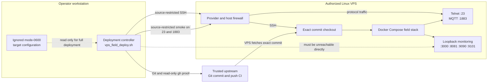
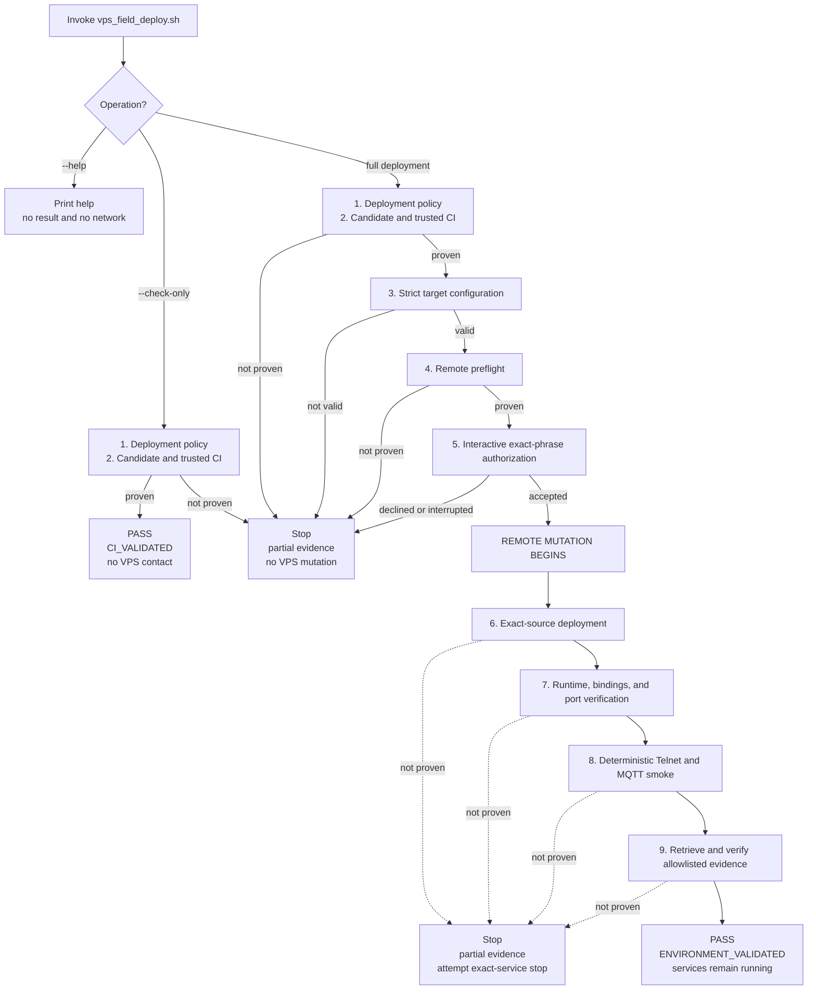

# EventHorizon Supported VPS Deployment

This is the canonical operator guide for deploying one exact EventHorizon Git
commit from one trusted operator workstation to one authorized Linux VPS. The
supported command ends with a validated stack in restricted validation posture;
it does not start public observation.

## 1. Supported boundary

The primary supported topology is:

- one Linux operator workstation with Git, SSH, Bash-compatible tooling,
  Python 3.10+, authenticated read-only GitHub CLI, and trusted-upstream
  repository access;
- one authorized Linux `x86_64` VPS with Bash, Git, Python 3, `curl`, `ss`,
  Docker Engine, Docker Compose v2, at least 1 GiB available memory, and at
  least 5 GiB available disk;
- a dedicated EventHorizon deployment directory and no conflicting production
  workloads, Compose projects, containers, volumes, or ports.

The supported topology has three trust domains. The workstation proves the
commit and controls deployment, GitHub supplies trusted source and CI evidence,
and the VPS fetches and runs that exact commit:



Arrow labels define the allowed communication paths. The dashed configuration
arrow is a local data dependency used only by full deployment. The dashed path
to monitoring is explicitly forbidden: the workstation must observe those
loopback-bound services as unreachable directly.

## 2. Security and exposure boundary

The operator must own the VPS or have explicit authorization to run the tarpit.
The SSH host key must be verified out of band and already present in the
workstation's `known_hosts`; the controller uses strict host-key checking.

The supported restricted validation posture is:

| Service | VPS binding | Workstation observation |
| --- | --- | --- |
| Telnet tarpit | `0.0.0.0:23/tcp` | reachable from the authorized workstation |
| MQTT tarpit | `0.0.0.0:1883/tcp` | reachable from the authorized workstation |
| Grafana | `127.0.0.1:3000/tcp` | unreachable directly |
| cAdvisor | `127.0.0.1:8081/tcp` | unreachable directly |
| Prometheus | `127.0.0.1:9090/tcp` | unreachable directly |
| Exporter | `127.0.0.1:9101/tcp` | unreachable directly |

The firewall requirement depends on the operation:

| Operation | VPS firewall requirement |
| --- | --- |
| `--help` | none; it is side-effect-free and performs no network access |
| `--check-only` | none; it does not read the target file, use SSH, or contact the VPS |
| full deployment | the configured SSH management port, TCP 23, and TCP 1883 are limited to the authorized workstation source; monitoring ports remain non-public |

Before deployment, configure provider and host firewall policy so TCP 23 and
1883 are limited to the authorized workstation source. Keep the existing
management SSH path source-restricted. The controller observes reachability
from one workstation; it cannot prove firewall posture from every network and
does not change firewall rules.

**Do not change SSH, TCP 23, or TCP 1883 ingress to `Any` for restricted
validation.** Broad public ingress is outside the deployment workflow and
requires a separate, explicitly authorized public-observation procedure.

Deployment authorization does not authorize prolonged public exposure.
Starting public observation is a separate, explicit workflow.

## 3. Prepare the operator workstation

From the trusted repository checkout, verify the required tools and
trusted-upstream remote:

```bash
git --version
ssh -V
python3 --version
gh --version
gh auth status
git remote -v
```

The trusted remote must be named `upstream` and refer to
`honeynet/EventHorizon`. Confirm that ordinary key-based SSH to the authorized
VPS succeeds before deployment. Do not weaken `StrictHostKeyChecking` to make a
connection pass.

Create the ignored target configuration:

```bash
cp deploy/vps-field.env.example deploy/vps-field.env
chmod 0600 deploy/vps-field.env
```

Edit only the values in `deploy/vps-field.env`. It must contain exactly the
documented keys:

```text
TARGET_ALIAS
VPS_HOST
VPS_USER
VPS_SSH_PORT
VPS_SSH_KEY
VPS_DEPLOY_DIR
VPS_PROJECT_NAME
ADMIN_SOURCE_CIDR
FIELD_TARPIT_CPU_LIMIT
FIELD_TARPIT_MEMORY_LIMIT
```

Use a non-sensitive alias such as `field-host`. `VPS_DEPLOY_DIR` must be an
absolute, narrowly scoped directory. An empty memory limit means no configured
limit. Never put a private-key value, password, token, deployment commit,
repository policy, or public-observation setting in this file.

The file is strict data, not shell syntax. Never `source` it or evaluate it as a
shell script. Confirm its safety before continuing:

```bash
stat -c '%a %n' deploy/vps-field.env
git check-ignore --quiet deploy/vps-field.env
```

The expected mode is `600`, and `git check-ignore` should exit zero.

## 4. Select and prove an exact deployment commit

Select a full SHA from the trusted `GSoC_2026` branch. It does not need to
remain the branch tip:

```bash
DEPLOY_COMMIT=$(git rev-parse HEAD)
printf '%s\n' "$DEPLOY_COMMIT"
```

Run the non-mutating eligibility check:

```bash
./scripts/vps_field_deploy.sh \
  --check-only \
  --commit "$DEPLOY_COMMIT"
```

Expected result:

```text
Outcome: PASS
Highest proven state: CI_VALIDATED
Remote mutation occurred: no
Field services remain running: no
```

`CI_VALIDATED` proves that the exact SHA is reachable from trusted upstream,
that its latest trusted push-workflow attempt and all seven required jobs
succeeded, and that every protected local controller file is byte-identical to
that commit. Local `HEAD` equality is not required. Unrelated untracked files
produce a warning because they are never sent to the VPS.

Do not continue if the outcome is `BLOCKED`, `FAIL`, `INCONCLUSIVE`, or
`ERROR`. Use the reported next action and retained evidence; do not bypass a
gate or substitute local checks for trusted CI.

A passing `--check-only` run neither requires nor verifies VPS firewall rules.
Before proceeding to the full deployment command, confirm the full-deployment
row in the security and exposure table above: the configured SSH management
port, TCP 23, and TCP 1883 must be source-restricted, never opened to `Any`.

## 5. Deploy the same exact commit

Review authorization and firewall policy, then run from an interactive terminal:

```bash
./scripts/vps_field_deploy.sh \
  --commit "$DEPLOY_COMMIT" \
  --env-file deploy/vps-field.env
```

The command repeats commit eligibility before parsing target data or contacting
the VPS. It then performs the fixed sequence:



The upper branches are non-mutating. Remote contact starts at preflight, but
remote mutation starts only after the exact authorization phrase is accepted.
Every real invocation writes evidence even when it stops early; `--help` is the
only exception.

```text
1. deployment policy
2. deployment candidate and trusted CI
3. strict target configuration
4. remote preflight
5. interactive authorization
6. exact-source deployment
7. runtime, binding, and workstation port verification
8. deterministic one-session Telnet/MQTT smoke
9. remote evidence retrieval and local verification
```

Before remote mutation, type the exact phrase displayed by the command:

```text
AUTHORIZE DEPLOY <full-SHA> TO <target-alias>
```

The phrase attests only that the target is authorized, firewall policy was
reviewed, and management access is source-restricted for that exact commit and
alias. A near match, redirected input, or operator refusal cannot authorize
deployment.

A complete successful result is:

```text
Outcome: PASS
Highest proven state: ENVIRONMENT_VALIDATED
Remote mutation occurred: yes
Field services remain running: yes
```

This proves the exact commit in this authorized environment. It does not claim
byte-identical image builds, production readiness, universal firewall posture,
or public-observation validity.

## 6. Interpret outcomes

State records what was successfully proven; outcome records why the invocation
stopped.

| Outcome | Meaning | Stable exit |
| --- | --- | ---: |
| `PASS` | The requested target state was proven | `0` |
| `BLOCKED` | Expected policy or prerequisite prevented progress | `2` |
| `FAIL` | An executed acceptance check produced an incorrect result | `3` |
| `INCONCLUSIVE` | Available evidence cannot prove the contract | `4` |
| `ERROR` | Tooling or infrastructure malfunctioned | `5` |
| `CANCELLED` | Authorization was declined | `6` |
| `CANCELLED` | Execution received `SIGINT` | `130` |

`highest_state` never reports a phase merely being attempted. A later blocker
cannot erase a previously proven `CI_VALIDATED` state, and a failed evidence
retrieval cannot grant `ENVIRONMENT_VALIDATED`.

## 7. Retained evidence

Every invocation except `--help` creates an immutable local directory:

```text
validation-output/deployments/<run-id>/
```

A complete successful deployment contains:

```text
result.json
summary.md
controller-manifest.json
ci-proof.json
authorization.json
remote-preflight.json
compose-config.json
deployment-manifest.json
health-and-ports.json
protocol-smoke.json
remote-evidence-index.json
evidence-index.json
```

`evidence-index.json` records local filenames, sizes, SHA-256 hashes, and
collection status. `remote-evidence-index.json` is the verified VPS manifest
for the five allowlisted remote artifacts. Partial runs preserve the safe
artifacts available at the stopping point.

The bundle excludes target-file contents, credentials, hostnames, addresses,
CIDRs, usernames, key paths, raw traffic and payloads, source-address data,
unrestricted logs, and full subprocess environments. Keep the ignored evidence
directory private unless a project-approved process explicitly selects a
redacted subset for publication.

## 8. Stop the field services safely

The supported deployment command intentionally leaves the six services running
after validation. To end the restricted validation posture, connect to the
authorized VPS using the values you entered in `deploy/vps-field.env`; do not
source that file:

```bash
ssh \
  -p <VPS_SSH_PORT> \
  -i <VPS_SSH_KEY> \
  <VPS_USER>@<VPS_HOST>
```

On the VPS, run:

```bash
cd <VPS_DEPLOY_DIR>
docker compose \
  -p <VPS_PROJECT_NAME> \
  -f docker-compose.yml \
  -f docker-compose.cost.yml \
  -f docker-compose.field.yml \
  stop
```

Confirm no managed service remains running:

```bash
docker compose \
  -p <VPS_PROJECT_NAME> \
  -f docker-compose.yml \
  -f docker-compose.cost.yml \
  -f docker-compose.field.yml \
  ps --status running --services
```

The second command should print no service names. Remove or close temporary
provider/host firewall rules for TCP 23 and 1883 after stopping, while
preserving the authorized SSH administration path.

Use `stop`, not `down --volumes`. Stopped containers, images, named volumes, and
deployment evidence are intentionally preserved for managed redeployment and
audit. Do not manually patch the remote checkout or use ordinary Compose
`start` as a substitute for the supported exact-commit workflow.

## 9. Redeploy or roll back

A managed redeployment uses the same command and the same nine gates. To
redeploy the current exact commit, rerun `--check-only` and then the full
deployment command. The controller reconciles the managed checkout, exact
service set, volumes, prior evidence, and stopped or running state.

Rollback is a new explicitly authorized deployment of a previously eligible
full SHA; it is not an automatic reset or restart. From a checkout whose
protected controller paths are byte-identical to the rollback commit:

```bash
ROLLBACK_COMMIT=<previous-full-40-character-sha>

./scripts/vps_field_deploy.sh \
  --check-only \
  --commit "$ROLLBACK_COMMIT"

./scripts/vps_field_deploy.sh \
  --commit "$ROLLBACK_COMMIT" \
  --env-file deploy/vps-field.env
```

An older commit without the supported deployment contract is reported as an
unsupported deployment commit. Do not bypass that blocker. If current local
controller files differ from an eligible rollback commit, use a separate
detached Git worktree at the rollback commit and place a mode-`0600`, ignored
copy of the target configuration in that worktree. Never replace protected
files piecemeal merely to pass the compatibility gate.

## 10. Failure and recovery rules

- Before mutation, resolve the reported blocker and retry; no rollback is
  needed.
- After services start, a failed runtime check, smoke, retrieval, or final local
  evidence write triggers an exact-service stop attempt. Volumes, images, and
  safe partial evidence remain preserved.
- If the result says field services may still be running, inspect the authorized
  VPS and run the documented Compose `stop` command before retrying.
- Correct source, policy, or Compose problems locally, review and commit them,
  wait for trusted CI on the exact new SHA, then deploy that SHA. Never patch
  only the VPS.
- Recovery and rollback always require a new explicit authorization phrase.

For metric interpretation and later controlled-validation stages, continue with
[`VALIDATION.md`](VALIDATION.md). For the task-based operator evaluation, use
[`WALKTHROUGH.md`](WALKTHROUGH.md).
