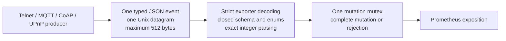

# Metric Catalog

This catalog describes the metric surface that EventHorizon actually exposes. The exact semantic authority remains the [cross-protocol metric contract](cross_protocol_metric_contract.md) and the [bounded JSON event contract](metric_json_event_contract.md).

## Scope and vocabulary

The implementation deliberately uses different observation units where the
protocols differ:

| Protocol | Frozen observation unit | Explicitly not used |
|---|---|---|
| Telnet | One tracked Telnet session per accepted TCP connection | Login, command, or negotiation session |
| MQTT | One tracked MQTT Network Connection per accepted TCP connection | Persistent MQTT Session or unique client |
| CoAP | Token-correlated request exchange and independent Message-ID-correlated outbound CON-response reliability exchange | Generic session, connected client, or interaction depth |
| UPnP | Independent SSDP discovery exchange and HTTP device-description exchange | Generic session or discovery-to-description lifecycle |

Server-side sent boundaries prove only that EventHorizon successfully handed
the complete bytes to the local transport. They do not prove client receipt,
parsing, application delivery, or fingerprint resistance.

## Implemented pipeline



The supported runtime has these properties:

- all four producers use the 22 typed wrappers in `shared/metric_events.c`;
- the exporter accepts exactly one UTF-8 JSON object per Unix datagram;
- both producer and exporter enforce the 512-byte ceiling;
- duplicate keys, unknown fields, invalid enums, invalid numeric forms, and
  incompatible protocol/event pairs are rejected before business mutation;
- every accepted event applies through one exporter mutation mutex;
- active gauges are producer-owned absolute observations;
- the legacy text parser, legacy metric emitters, accepted-message counter,
  high-cardinality legacy families, and aliases are removed from the supported
  path; and
- Endlessh/SSH does not mount or write to the metric socket.

Existing Prometheus collectors are gathered independently. The mutation mutex
prevents two ingested events from interleaving, but it does not guarantee a
cross-family scrape snapshot. Reconciliation therefore uses settled boundary
scrapes after the event mutation has completed.

## Metric-family summary

Histogram sample counts include every bucket (including `+Inf`), `_sum`, and
`_count` for every initialized outcome population.

| Family | Type | Exact explicit labels | Initialized series or samples | Disposition |
|---|---|---|---:|---|
| `eventhorizon_protocol_actions_total` | counter | `{protocol,action}` | 26 series | changed |
| `eventhorizon_read_errors_total` | counter | `{protocol,reason}` | 8 series | changed |
| `eventhorizon_write_errors_total` | counter | `{protocol,reason}` | 16 series | changed |
| `eventhorizon_exporter_malformed_messages_total` | counter | `{reason}` | 6 series | changed |
| `eventhorizon_bytes_received_total` | counter | `{protocol}` | 2 series | changed |
| `eventhorizon_bytes_sent_total` | counter | `{protocol}` | 2 series | changed |
| `total_connects` | counter | `{server}` | 2 series | changed |
| `current_connected_clients` | gauge | `{server}` | 2 series | changed |
| `eventhorizon_completed_sessions_total` | counter | `{protocol="telnet",disconnect_reason}` | 5 series | changed |
| `eventhorizon_session_duration_ms` | histogram | `{protocol="telnet"}` | 14 samples | changed |
| `eventhorizon_session_interaction_depth_total` | counter | `{protocol="telnet",depth_level}` | 4 series | changed |
| `eventhorizon_telnet_first_write_delay_ms` | histogram | none | 17 samples | added |
| `eventhorizon_telnet_inter_write_interval_ms` | histogram | none | 17 samples | added |
| `eventhorizon_mqtt_network_connection_finalizations_total` | counter | `{finalization_reason}` | 10 series | added |
| `eventhorizon_mqtt_network_connection_duration_ms` | histogram | none | 22 samples | added |
| `eventhorizon_mqtt_network_connection_interaction_depth_total` | counter | `{depth_level}` | 4 series | added |
| `eventhorizon_mqtt_connect_to_connack_duration_ms` | histogram | none | 22 samples | added |
| `eventhorizon_coap_active_request_exchanges` | gauge | none | 1 series | added |
| `eventhorizon_coap_request_exchange_duration_ms` | histogram | `{outcome}` | 42 samples | added |
| `eventhorizon_coap_active_con_response_exchanges` | gauge | none | 1 series | added |
| `eventhorizon_coap_con_response_exchange_duration_ms` | histogram | `{outcome}` | 60 samples | added |
| `eventhorizon_upnp_active_description_responses` | gauge | none | 1 series | added |
| `eventhorizon_upnp_description_stream_duration_ms` | histogram | `{outcome}` | 42 samples | added |

No metric has an identity, address, endpoint, Client Identifier, URI, path,
LOCATION, topic, Topic Filter, Token, Message ID, Packet Identifier,
credential, payload, content, errno, error-text, retry-count, QoS, phase,
configuration, experiment, commit, or fingerprint label.

## Exact HELP and TYPE contracts

```text
# HELP total_connects Total accepted TCP connections tracked by the EventHorizon Telnet and MQTT servers.
# TYPE total_connects counter
# HELP current_connected_clients Current accepted TCP connections tracked by the EventHorizon Telnet and MQTT servers.
# TYPE current_connected_clients gauge

# HELP eventhorizon_protocol_actions_total Total protocol actions crossing their frozen EventHorizon server-side observation boundaries.
# TYPE eventhorizon_protocol_actions_total counter
# HELP eventhorizon_read_errors_total Total primary unrecoverable read-side I/O failures that finalize tracked Telnet or MQTT TCP connections.
# TYPE eventhorizon_read_errors_total counter
# HELP eventhorizon_write_errors_total Total write-side I/O failures crossing frozen EventHorizon reliability boundaries.
# TYPE eventhorizon_write_errors_total counter
# HELP eventhorizon_exporter_malformed_messages_total Total malformed, unsupported, or replayed metric datagrams rejected by the EventHorizon exporter.
# TYPE eventhorizon_exporter_malformed_messages_total counter
# HELP eventhorizon_bytes_received_total Positive bytes returned by Telnet and MQTT client-facing reads; includes protocol framing and incomplete input, and excludes EOF, failed, retryable, or zero-byte I/O and internal telemetry.
# TYPE eventhorizon_bytes_received_total counter
# HELP eventhorizon_bytes_sent_total Positive bytes returned by Telnet and MQTT client-facing writes; includes partial writes and protocol framing, and excludes failed, retryable, or zero-byte I/O and internal telemetry.
# TYPE eventhorizon_bytes_sent_total counter

# HELP eventhorizon_completed_sessions_total Total finalized tracked Telnet TCP sessions by finalization reason.
# TYPE eventhorizon_completed_sessions_total counter
# HELP eventhorizon_session_duration_ms Duration in milliseconds from accepted Telnet TCP connection to exactly-once session finalization.
# TYPE eventhorizon_session_duration_ms histogram
# HELP eventhorizon_session_interaction_depth_total Total finalized tracked Telnet sessions by bounded meaningful application-interaction depth.
# TYPE eventhorizon_session_interaction_depth_total counter
# HELP eventhorizon_telnet_first_write_delay_ms Duration in milliseconds from accepted Telnet TCP connection to its first positive server write.
# TYPE eventhorizon_telnet_first_write_delay_ms histogram
# HELP eventhorizon_telnet_inter_write_interval_ms Duration in milliseconds between consecutive positive server writes on a tracked Telnet session.
# TYPE eventhorizon_telnet_inter_write_interval_ms histogram

# HELP eventhorizon_mqtt_network_connection_finalizations_total Total finalized tracked MQTT Network Connections by finalization reason.
# TYPE eventhorizon_mqtt_network_connection_finalizations_total counter
# HELP eventhorizon_mqtt_network_connection_duration_ms Duration in milliseconds from accepted MQTT TCP connection to exactly-once Network Connection finalization.
# TYPE eventhorizon_mqtt_network_connection_duration_ms histogram
# HELP eventhorizon_mqtt_network_connection_interaction_depth_total Total finalized MQTT Network Connections by bounded meaningful application-interaction depth.
# TYPE eventhorizon_mqtt_network_connection_interaction_depth_total counter
# HELP eventhorizon_mqtt_connect_to_connack_duration_ms Duration in milliseconds from accepted supported MQTT CONNECT to complete successful CONNACK transmission.
# TYPE eventhorizon_mqtt_connect_to_connack_duration_ms histogram

# HELP eventhorizon_coap_active_request_exchanges Current accepted CoAP GET request exchanges awaiting response transmission or termination.
# TYPE eventhorizon_coap_active_request_exchanges gauge
# HELP eventhorizon_coap_request_exchange_duration_ms Duration in milliseconds from accepted CoAP GET request to response transmission or termination.
# TYPE eventhorizon_coap_request_exchange_duration_ms histogram
# HELP eventhorizon_coap_active_con_response_exchanges Current transmitted CoAP Confirmable response exchanges awaiting ACK, RST, or retry exhaustion.
# TYPE eventhorizon_coap_active_con_response_exchanges gauge
# HELP eventhorizon_coap_con_response_exchange_duration_ms Duration in milliseconds from first CoAP Confirmable response transmission to ACK, RST, or retry exhaustion.
# TYPE eventhorizon_coap_con_response_exchange_duration_ms histogram

# HELP eventhorizon_upnp_active_description_responses Current UPnP device-description responses that have started but not completed or terminated.
# TYPE eventhorizon_upnp_active_description_responses gauge
# HELP eventhorizon_upnp_description_stream_duration_ms Duration in milliseconds from the first positive device-description response write to completion or termination.
# TYPE eventhorizon_upnp_description_stream_duration_ms histogram
```

## Closed label schemas

### Protocol actions

`eventhorizon_protocol_actions_total{protocol,action}` initializes exactly
these compatible pairs:

| `protocol` | Allowed `action` values |
|---|---|
| `upnp` | `ssdp_msearch_received`, `ssdp_discovery_response_sent`, `description_get_received`, `description_response_started`, `description_response_completed`, `description_response_terminated` |
| `coap` | `get_request_received`, `get_response_sent`, `get_request_terminated`, `con_response_sent`, `con_response_retransmitted`, `con_response_ack_received`, `con_response_rst_received`, `con_response_retry_exhausted` |
| `mqtt` | `connect_accepted`, `connack_sent`, `publish_received`, `subscribe_received`, `unsubscribe_received`, `suback_sent`, `unsuback_sent`, `puback_sent`, `pubrec_sent`, `pubrel_received`, `pubcomp_sent`, `subscription_publish_sent` |

Telnet has no action series. A family-wide sum mixes unrelated protocol
boundaries and has no useful protocol meaning.

### Reliability, lifecycle, and outcomes

| Family | Exact label values |
|---|---|
| `eventhorizon_read_errors_total` | `protocol="telnet"|"mqtt"`; `reason="timeout"|"reset"|"closed"|"other"` |
| `eventhorizon_write_errors_total` | `protocol="upnp"|"coap"|"telnet"|"mqtt"`; same four reasons |
| `eventhorizon_exporter_malformed_messages_total` | `reason="empty_message"|"missing_fields"|"unknown_format"|"unknown_server"|"invalid_number"|"unsupported_event"` |
| `eventhorizon_bytes_received_total`, `eventhorizon_bytes_sent_total` | `protocol="telnet"|"mqtt"` |
| `total_connects`, `current_connected_clients` | `server="Telnet"|"MQTT"` |
| `eventhorizon_completed_sessions_total` | `protocol="telnet"`; `disconnect_reason="peer_closed"|"read_error"|"write_error"|"server_shutdown"|"bounded_policy"` |
| `eventhorizon_session_interaction_depth_total` | `protocol="telnet"`; `depth_level="0"|"1"|"2"|"3"` |
| `eventhorizon_mqtt_network_connection_finalizations_total` | `finalization_reason="peer_closed"|"disconnect_received"|"connect_refused"|"operation_refused"|"protocol_error"|"keep_alive_timeout"|"read_error"|"write_error"|"server_shutdown"|"bounded_policy"` |
| `eventhorizon_mqtt_network_connection_interaction_depth_total` | `depth_level="0"|"1"|"2"|"3"` |
| `eventhorizon_coap_request_exchange_duration_ms` | `outcome="response_sent"|"terminated"` |
| `eventhorizon_coap_con_response_exchange_duration_ms` | `outcome="ack_received"|"rst_received"|"retry_exhausted"` |
| `eventhorizon_upnp_description_stream_duration_ms` | `outcome="completed"|"terminated"` |

The producer maps actual socket failures into the four I/O reasons. `closed`
means bounded closed-socket conditions such as broken pipe, not connected, or
shutdown. The exporter validates only the enum and never interprets errno.
TCP EOF is a clean peer finalization, not an I/O error. A short positive UDP
send is write reason `other`; a positive partial TCP write remains byte/timing
evidence and is not automatically an error.

## Histogram buckets

All bucket boundaries are milliseconds. Prometheus adds `+Inf`, `_sum`, and
`_count` to the listed finite buckets.

| Histogram | Exact finite buckets |
|---|---|
| `eventhorizon_session_duration_ms` | `10 50 100 250 500 1000 2500 5000 10000 30000 60000` |
| `eventhorizon_telnet_first_write_delay_ms` | `10 25 50 75 100 125 150 200 250 500 1000 2500 5000 10000` |
| `eventhorizon_telnet_inter_write_interval_ms` | `10 25 50 75 100 125 150 200 250 500 1000 2500 5000 10000` |
| `eventhorizon_mqtt_connect_to_connack_duration_ms` | `1 2 5 10 25 50 75 100 125 150 200 250 500 1000 2500 5000 10000 30000 60000` |
| `eventhorizon_mqtt_network_connection_duration_ms` | `10 50 100 250 500 1000 2500 5000 10000 30000 60000 120000 300000 600000 1800000 3600000 21600000 86400000 604800000` |
| `eventhorizon_coap_request_exchange_duration_ms` | `1 2 5 10 25 50 100 250 500 1000 2500 5000 10000 30000 60000 120000 300000 600000` |
| `eventhorizon_coap_con_response_exchange_duration_ms` | `1 2 5 10 25 50 100 250 500 1000 2000 3000 6000 12000 24000 45000 60000` |
| `eventhorizon_upnp_description_stream_duration_ms` | `1 2 5 10 25 50 100 250 500 1000 2500 5000 10000 15000 20000 25000 30000 60000` |

Histogram sums are cumulative observations, not configured delays. An active
exchange has no duration observation until it reaches a frozen terminal
boundary.

## Producer event catalog

Every event also requires exactly `v=1`, `protocol`, and `event`. Every field
listed below is required; any unlisted field is rejected. Integer fields are
decoded as integers rather than through `float64`.

### Telnet: five events

| Event | Exact event fields | Business mutation |
|---|---|---|
| `connection_accepted` | `active_count_after` | Increment Telnet `total_connects`; set absolute active gauge |
| `connection_finalized` | `finalization_reason`, `duration_ms`, `depth_level`, `active_count_after`, `io_reason` | Update finalization, session duration, depth, active gauge, and applicable primary I/O error |
| `positive_read` | `bytes` | Add positive received bytes |
| `first_positive_write` | `duration_ms`, `bytes` | Add positive sent bytes and observe first-write delay |
| `subsequent_positive_write` | `duration_ms`, `bytes` | Add positive sent bytes and observe inter-write interval |

### MQTT: seven events

| Event | Exact event fields | Business mutation |
|---|---|---|
| `connection_accepted` | `active_count_after` | Increment MQTT `total_connects`; set absolute active gauge |
| `connection_finalized` | `finalization_reason`, `duration_ms`, `depth_level`, `active_count_after`, `io_reason` | Update finalization, Network Connection duration, depth, gauge, and applicable primary I/O error |
| `positive_read` | `bytes` | Add positive received bytes |
| `positive_write` | `bytes` | Add positive sent bytes, including partial writes |
| `protocol_action` | `action` | Increment one of the 11 compatible non-CONNACK actions |
| `connack_sent` | `duration_ms` | Increment `connack_sent`; observe CONNECT-to-CONNACK duration |
| `secondary_write_error` | `io_reason` | Increment only the MQTT write-error counter |

### CoAP: six events

| Event | Exact event fields | Business mutation |
|---|---|---|
| `request_received` | `request_active_count_after` | Increment `get_request_received`; set request gauge |
| `request_finalized` | `outcome`, `duration_ms`, `request_active_count_after` | Increment request terminal action; observe request duration; set gauge |
| `con_response_sent` | `request_duration_ms`, `request_active_count_after`, `con_active_count_after` | Increment `get_response_sent` and `con_response_sent`; observe request duration; set both gauges |
| `con_response_retransmitted` | none | Increment only `con_response_retransmitted` |
| `con_response_finalized` | `outcome`, `duration_ms`, `con_active_count_after` | Increment CON terminal action; observe CON duration; set gauge |
| `write_error` | `io_reason` | Increment only the CoAP write-error counter |

### UPnP: four events

| Event | Exact event fields | Business mutation |
|---|---|---|
| `protocol_action` | `action` | Increment valid M-SEARCH, discovery-response, or description-GET action |
| `description_response_started` | `active_count_after` | Increment response-started action; set absolute active gauge |
| `description_response_finalized` | `outcome`, `duration_ms`, `active_count_after` | Increment completed/terminated action; observe duration; set gauge |
| `write_error` | `io_reason` | Increment only the UPnP write-error counter |

`active_count_after` and the CoAP active-count fields are bounded `uint32`
absolute producer state. Positive byte values are `1..9007199254740991`.
General durations are `0..9007199254740991`; completed UPnP duration is
bounded to `0..30000`. Depth is the integer `0..3`.

The exporter performs schema and aggregate-mutation validation. It cannot
validate connection-local MQTT sequencing or request-local CoAP correlation
because Client Identifiers, Packet Identifiers, Tokens, Message IDs, and
connection identities are intentionally absent from telemetry. Those remain
producer invariants.

## Important success boundaries

- Telnet and MQTT positive partial TCP writes add actual byte evidence.
- The first positive Telnet write observes first-write timing; every later
  positive write observes one inter-write interval.
- A partial MQTT Control Packet write emits no completed-packet action.
- A CoAP sent or retransmitted action requires `sendto()` to return the exact
  encoded datagram length.
- A short positive UDP send emits no sent action and is a write error with
  reason `other`.
- `con_response_sent` atomically finalizes the CoAP request exchange and starts
  the independent outbound CON reliability exchange.
- The first positive UPnP response write starts the description response,
  including a partial positive write.
- UPnP completion requires complete HTTP/1.1 headers and exactly the declared
  `Content-Length` bytes of a valid `Content-Type: text/xml` description to be
  written within 30 seconds.
- UPnP completion versus termination is selected using the full monotonic
  timestamp before elapsed milliseconds are truncated. Encoded `30000` is
  valid for either boundary case.
- Zero, interrupted, retryable, would-block, pending, and failed operations do
  not cross a success boundary.

## Reconciliation contracts

The following equations require a complete, uninterrupted process epoch and
settled baseline/final scrapes. Restart, reset, missing telemetry, missing
scrapes, possible duplicate delivery, inconsistent absolute gauges, or a torn
concurrent scrape makes the affected result `INCONCLUSIVE`.

```text
delta(total_connects{server="Telnet"})
- sum(delta(eventhorizon_completed_sessions_total{protocol="telnet"}))
= active_end_telnet - active_start_telnet

delta(total_connects{server="MQTT"})
- sum(delta(eventhorizon_mqtt_network_connection_finalizations_total))
= active_end_mqtt - active_start_mqtt

sum(delta(eventhorizon_completed_sessions_total{protocol="telnet"}))
= delta(eventhorizon_session_duration_ms_count{protocol="telnet"})
= sum(delta(eventhorizon_session_interaction_depth_total{protocol="telnet"}))

sum(delta(eventhorizon_mqtt_network_connection_finalizations_total))
= delta(eventhorizon_mqtt_network_connection_duration_ms_count)
= sum(delta(eventhorizon_mqtt_network_connection_interaction_depth_total))

delta(eventhorizon_mqtt_connect_to_connack_duration_ms_count)
= delta(eventhorizon_protocol_actions_total{protocol="mqtt",action="connack_sent"})

delta(eventhorizon_coap_request_exchange_duration_ms_count{outcome="response_sent"})
= delta(eventhorizon_protocol_actions_total{protocol="coap",action="get_response_sent"})

delta(eventhorizon_coap_request_exchange_duration_ms_count{outcome="terminated"})
= delta(eventhorizon_protocol_actions_total{protocol="coap",action="get_request_terminated"})

sum(delta(eventhorizon_coap_con_response_exchange_duration_ms_count))
= sum(delta(eventhorizon_protocol_actions_total{protocol="coap",action=~"con_response_ack_received|con_response_rst_received|con_response_retry_exhausted"}))

delta(eventhorizon_upnp_description_stream_duration_ms_count{outcome="completed"})
= delta(eventhorizon_protocol_actions_total{protocol="upnp",action="description_response_completed"})

delta(eventhorizon_upnp_description_stream_duration_ms_count{outcome="terminated"})
= delta(eventhorizon_protocol_actions_total{protocol="upnp",action="description_response_terminated"})
```

For each histogram outcome, the `+Inf` bucket equals `_count`. Byte-counter
deltas equal the sum of positive TCP read/write return values for that
protocol. The malformed-family delta sum equals the number of rejected metric
datagrams in a controlled no-reset fixture.

## What the catalog proves—and does not prove

| Evidence | What it proves | What it does not prove |
|---|---|---|
| TCP lifecycle | Accepted/finalized Telnet sessions and MQTT Network Connections | Unique clients, people, devices, logins, MQTT Sessions, or accepted CONNECT |
| Protocol actions | Counts of exact frozen server-side action boundaries | Client receipt, parsing, action equality, engagement, or fingerprint resistance |
| Active gauges | Latest producer-observed absolute active work | Complete history or recovery after exporter restart |
| Histograms | Distribution of finalized monotonic server-side durations | Configured delay, round-trip time, active age, or client-perceived latency |
| Application bytes | Positive Telnet/MQTT socket-return bytes | Complete messages, meaningful content, TCP/IP wire volume, or client receipt |
| I/O errors | Bounded qualifying server-side socket failures | Client fault, packet loss, protocol failure rate, or telemetry completeness |
| Malformed events | Invalid metric datagrams observed and rejected by the exporter | Valid-datagram delivery completeness, duplicate detection, or valid producer behavior |

Container-runtime metrics remain separate defender-cost evidence. Session
JSONL remains separate research evidence. Neither is reconstructed from this
Prometheus catalog.

## Removed legacy surface

The supported exporter does not expose these legacy families or aliases:

- `eventhorizon_exporter_messages_total{status}`;
- `eventhorizon_session_starts_total{protocol}`;
- `total_trapped_time_ms` and `tarpitted_clients`;
- `telnet_pit_input{ip}`;
- `mqtt_pit_*` credential, topic, version, and aggregate counters;
- `upnp_M-Search_requests{ip}`;
- `upnp_non_M-Search_requests{ip}`;
- `upnp_other_http_requests{method,url}`;
- generic UPnP/CoAP lifecycle, connected-client, duration, or interaction-depth
  series; and
- all old/new action-name aliases.

No accepted-message counter, metric-delivery percentage, exporter-derived
active gauge, or telemetry-reliability percentage replaces them.

## Validation evidence

The implemented surface has passed both isolated tests and a real deployed
stack validation.

| Validation | Observed evidence | Result |
|---|---|---|
| Zero surface | Required bounded series initialized to zero; forbidden legacy-family search empty | PASS |
| Telnet real wire | One accept/finalization; received `7` bytes; sent `8`; first write `100 ms`; two later writes; duration `401 ms`; depth `2`; no errors | PASS |
| MQTT real wire | Supported CONNECT and complete four-byte CONNACK; `20` received bytes; `4` sent; disconnect finalization; depth `1`; no errors | PASS |
| CoAP real wire | NON GET response `51450001a5d10a0aff4141414141`; request completed in `1001 ms`; no CON population or errors | PASS |
| UPnP real wire | Valid SSDP exchange; HTTP/1.1 `text/xml`; exact 608-byte body; no Transfer-Encoding; completed duration `10000 ms`; no errors | PASS |
| Isolated Go suite | Public Unix-socket ingestion plus producer integration tests: `ok prometheus 17.815s` | PASS |

These observations validate the representative MVP boundaries. They do not
turn missing or reset evidence into a pass; the three-way
`PASS`/`FAIL`/`INCONCLUSIVE` evidence model remains authoritative.
